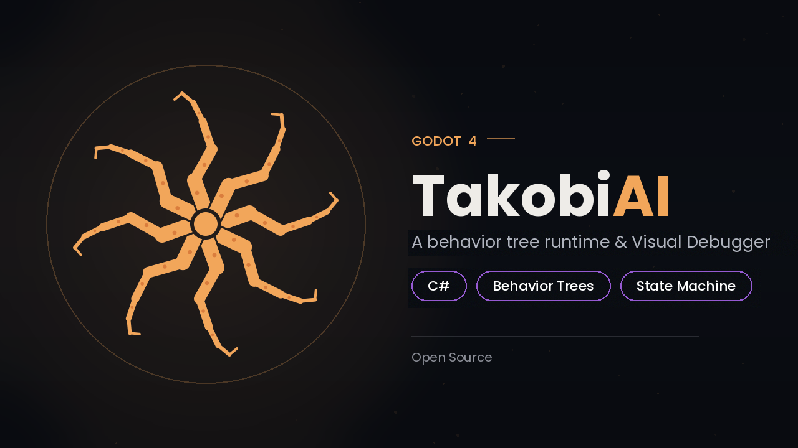

# TakobiAI



A behavior tree library for **Godot 4 / C#**, built on native Godot editor APIs


## Features

- **Live Debugger** — a dockable panel (built on Godot's `EditorDebuggerPlugin`) that visualizes tick status and node state in real time while your game runs.


- **Native profiling** — tree counts and per-tree tick times show up directly in Godot's built-in **Monitors** tab, alongside FPS and memory.


- **Custom inspectors** — method calls, signal emitters/awaiters, and Blackboard comparisons get dedicated dropdown editors instead of raw string fields.

- **Rich node library** — reactive and randomized composites (`ReactiveSequence`, `ReactiveSelector`, `Parallel`, `WeightedSelector` with `Weight`/`WeightFromBlackboard` decorators), plus a full set of decorators (`Cooldown`, `Retry`, `Timeout`, `Repeater`, and more) for controlling flow without extra scripting.
- **Blackboard binding via `$key`** — bind exported fields on any node to a Blackboard value with a `$` prefix.
- **SubTree composition** — nest and reuse whole trees as a single leaf, with optional Blackboard sharing and circular-reference protection.
- **Hierarchical State Machine (`TakobiHSM`)** — a lightweight, code-first, generic HSM with a fluent state/transition API and support for nested sub-machines, usable standalone or alongside your behavior trees.

```csharp
private enum State { Idle, Run, Combat }
private enum CombatState { Attack, Dodge }

private readonly TakobiHSM<State> hsm = new();
private readonly TakobiHSM<CombatState> combatHsm = new();

public override void _Ready()
{
	hsm.AddState(State.Idle).OnEnter(() => GD.Print("Idle"));
	hsm.AddState(State.Run).OnEnter(() => GD.Print("Run"));

	// nests combatHsm as a sub-machine — it's entered, ticked, and paused
	// automatically alongside the Combat state's own lifecycle
	hsm.AddState(State.Combat).WithSubMachine(combatHsm);

	hsm.AddTransition(State.Idle, State.Run).When(() => Velocity.Length() > 0);
	hsm.AddTransition(State.Run, State.Idle).When(() => Velocity.Length() == 0);

	hsm.SetInitialState(State.Idle);
	hsm.Start();
}

public override void _PhysicsProcess(double delta) => hsm.Tick(delta);
```

- **Zero-allocation tick path** — argument resolution is cached ahead of time, so ticking a tree doesn't generate garbage every frame.

# Installation

1. [Download Latest Release](https://github.com/AhmedGD1/takobi_ai/releases/tag/v1.0.0)
2. Unpack the `addons/takobi_ai` folder into your `/addons` folder within the Godot project
3. Enable this addon within the Godot settings: `Project > Project Settings > Plugins`
4. Move `script_templates` into your project folder.

## License

MIT
